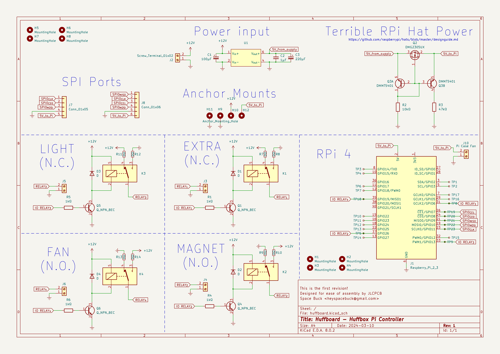

# Huffboard

## A board for the Huffbox

# [Learn about the Huffbox HERE!](https://huffbox.aliencat.dev/)

This is a first attempt at improving the connections between the control device--a Raspberry Pi 4--and peripherals using the Pi's GPIO (electromagnets, fans, lights, LED matrix). It was designed to be easy to assemble using JLCPCB's assembly service. If you want to order a board through JLC's assembly service, you will need the files found in the `jlcpcb/production_files` directory.

## Software necessary to inspect the design files

- [KiCad 8](https://www.kicad.org/) or a later version compatible with KiCad 8 projects
- To look at the JLCPCB assembly parts used, it helps to have the [KiCad JLCPCB Tools plugin by Bouni](https://github.com/bouni/kicad-jlcpcb-tools)

## Known issues

- Power has to be supplied to the Pi using its regular power cable. I had hoped to power it through the Huffboard, but the Raspberry Pi Foundation's [guidelines on powering a Pi via a hat](https://github.com/raspberrypi/hats/blob/bcc5afd013360c93f258c9e2cd7d7131e5ca659f/backpowering-diagram.png) are literally sketchy, and their recommended parts don't provide enough power to keep the Pi on.
- I don't like how the relays work or the 0Ω resistors being used as configuration pins. Going to change that in the next revision.

## Schematic

[A PDF of the schematic can be found here.](Schematic.pdf)

